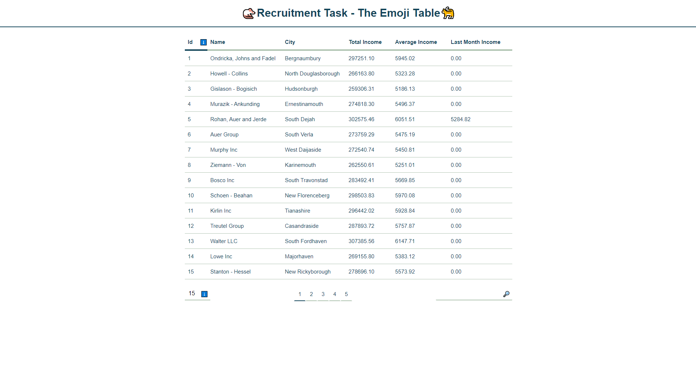

# Recruitment Task Table



This is The Table Project that covers **Filtering**, **Sorting**, dynamic **pagination** it was bootstrapped with **Create-React-App**, original Readme can be found in README.old.md file.

## Table of Contents

- [Recruitment Task Table](#recruitment-task-table)
  - [Table of Contents](#table-of-contents)
  - [Prerequisites](#prerequisites)
  - [Installing](#installing)
  - [Running Application](#running-application)
  - [Running Tests](#running-tests)
  - **[Notes To Reviewers](#notes-to-reviewers)**
  - **[Tech Stack](#tech-stack)**
    - [Library / Framework](#library--framework)
    - [State Management](#state-management)
    - [Type Checking](#type-checking)
    - [Styling](#styling)
    - [AJAX](#ajax)
    - [Testing](#testing)

## Prerequisites

**Node** (>=10.16.0)

however i recommend using latest version 14.5.0 (at the time of writing)

## Installing

To install **Recruitment-Task-Table** use **Yarn** or **NPM**

```
npm install
```

```
yarn install
```

## Running Application

To Start Development Server you need to type :

```
yarn start
```

or

```
npm run start
```

## Running Tests

To run tests you need to type :

```
yarn test
```

or

```
npm run test
```

## Notes To Reviewers

On App Initialization I am getting all the needed data once and then I calculate incomes, so it can take a while, depends on your Internet Connection :/.

At first I was thinking about requesting only the income data for companies that are visible. But the task description required sorting and filtering through all columns in Table, so I have to stick with pre-fetching and pre-calculating all the data.

I totally didn't see the point of implementing sorting algorithm. I ended up with using native **Array.prototype.sort** function that I believe under the hood uses **Timsort** in **V8** and **mergesort** in **Gecko**, probably with many optimizations, So I decided it will be faster than writing my own implementation of some sorting algorithm and reinventing the wheel once again.

I added small select input to change the number of records on one page, You didn't specified it in task description but I believe that is something that every responsive table should have to not force the user to scroll the whole page just to get to controls,

In task description there was nothing about compatibility so it may not work correctly on older browsers, but all modern applications should not have any problems :)

## Tech Stack

### Library / Framework

I Decided to use **React** for this application, I was trying to follow the crowd so i ended up with hooks based application.
I didn't wrote any **webpack** config for this project i simply used **create-react-app**

### State Management

I didn't used any state management libraries such as **redux** or **mobx** - I decided that it will overcomplicate things in such small app, however I probably should use native context solution - just to clean the whole app a little bit.

### Type Checking

I didn't used any static type checking solutions such as **typescript** or **flow**, again I decided it will overcomplicate things, but I used **PropTypes** to have some control on types :)

### Styling

To Style the whole application i used **styled-components**, to achieve same look on every modern browser i used normalize. The App UI is probably not the strongest point of the whole project, but i didn't wanted that styling process to took days ;d

### AJAX

To make **http** calls I used **axios** just to have possibility to cancel the request in easy way and use interceptors. I didn't used these features so i probably should rewrite the whole thing to use native **fetch** function - just to save the bits :P

### Testing

As I mentioned earlier this is app bootstrapped with **CRA** so I sticked with **jest** and **react-testing-library**.


[Back to top](#Recruitment-Task-Table)